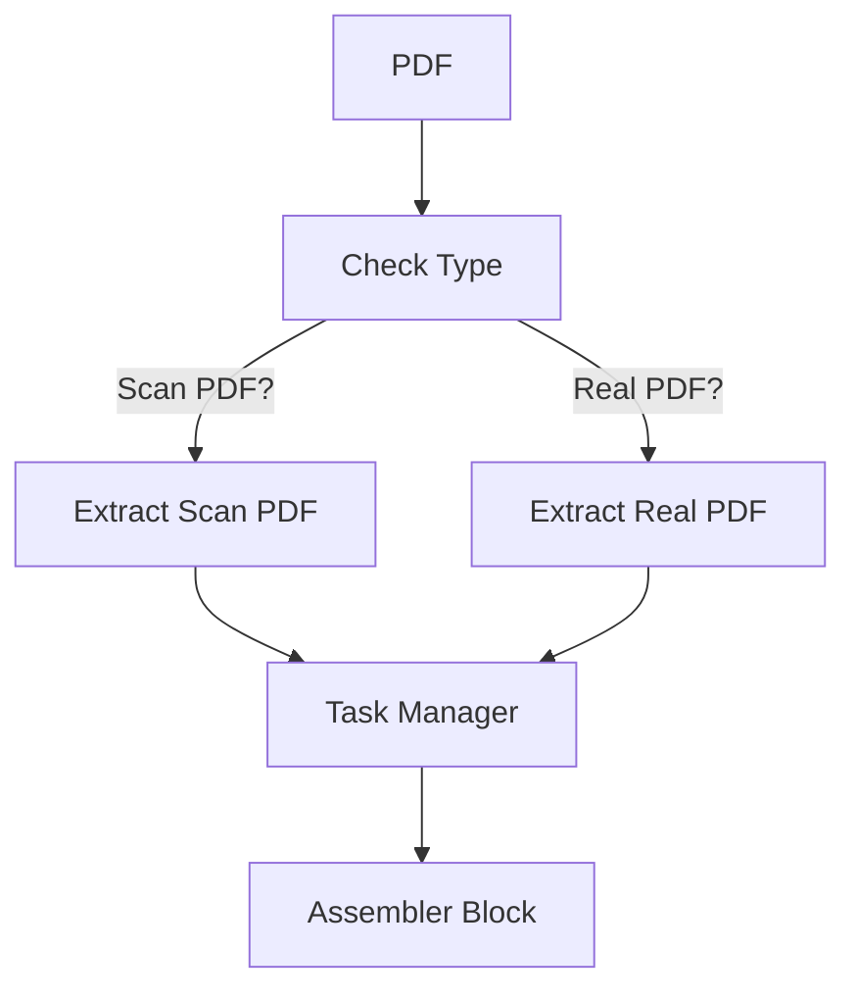

# Extract PDF

## Entrée :  PDF file 

## Sortie : Liste des résultats textes

Cette application traite l'extraction du contenu des fichiers PDF. 

### Controller 

Le fichier est envoyé à la classe **" Controller "** pour être analysé par la classe **" CheckType "** afin de déterminer si chaque page est considéré comme un vrai PDF (exploitable sans ocr) ou un PDF scanné (une image convertie en pdf). 

Une fois analysé, la liste des pages des vrais PDF est envoyée grâce à la classe **"Send Request"** à l'application **"Extract Real PDF"** ainsi que le fichier PDF et la liste des pages des scans est envoyée à l'application **"Extract Scan PDF"** ainsi que le fichier PDF. Les résultats sont ensuite stockés dans une liste. La liste des résultats est donc envoyer à l'application **"Assembler Block"** pour être remis dans dans l'ordre initial grâce au numéro de page. Les résultats sont des textes qui sont stockés dans une liste. Une classe **"Task Manager"** est utilisée pour gérer le nombre de tâche qui sont traitées en même temps.

### CheckType
#### Entrée : PDF file dans la variable "doc"
#### Sortie : Dictionnaire de liste des numéros de pages des scans et des vrais pdf

Pour toutes les pages du document, on vérifie si une image est présente dans la page et on la compare avec la taille de la page pour déterminer si c’est un scan ou pas. Si on trouve une image et que sa taille est supérieure ou égale à 90% de la taille de la page OU que la taille de l’image est inférieure à 5 pixels (car des fichiers protégés convertissent le texte en plusieurs pixels pour éviter la modification), alors, la page est considérée comme un scan et son numéro est stocké dans un dictionnaire avec la clé "scan". Sinon, la page est un vrai pdf et son numéro est stocké dans le dictionnaire avec la clé "real_pdf".

### Send Request

Cette classe permet de gérer toutes les fonctions qui commnuniquent avec d'autres applications. Ici, on l'utilise pour communiquer avec les applications **"Extract Real PDF"**, **"Extract Scan PDF"**  et **"Assembler Block"**.

