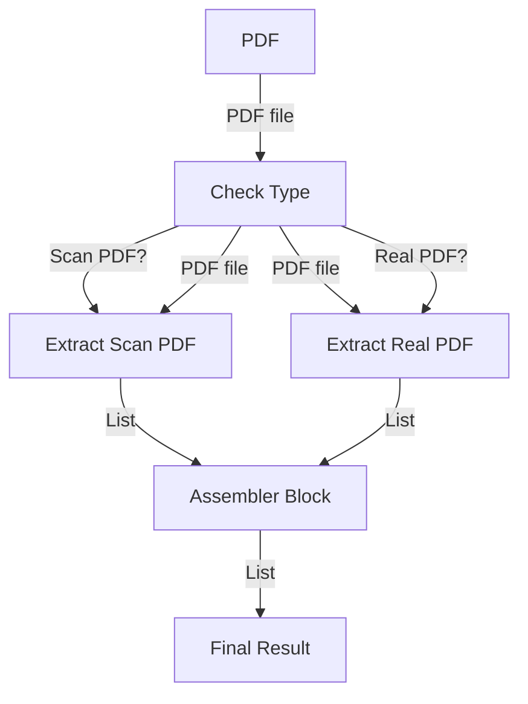
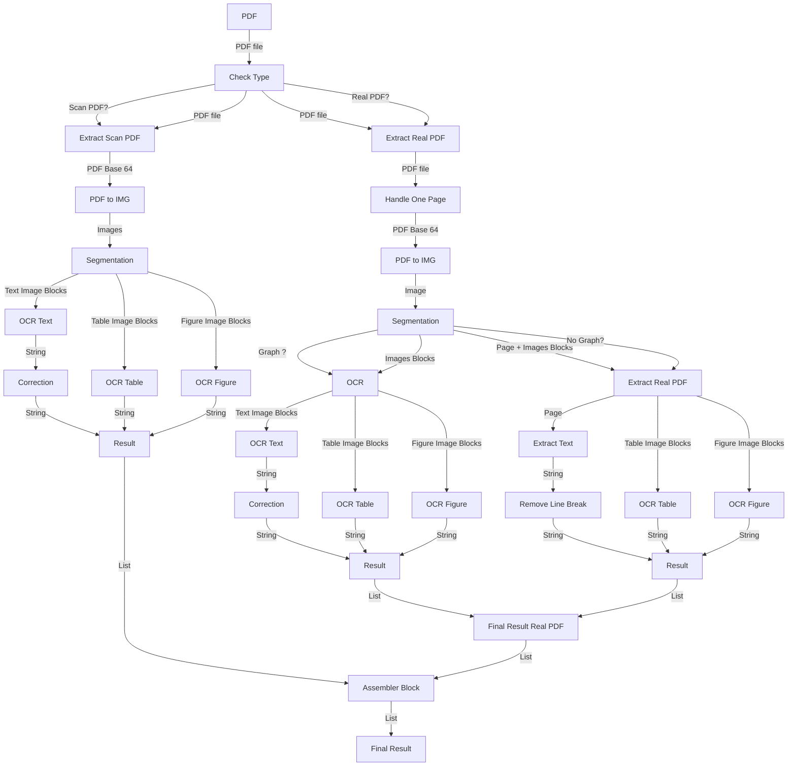
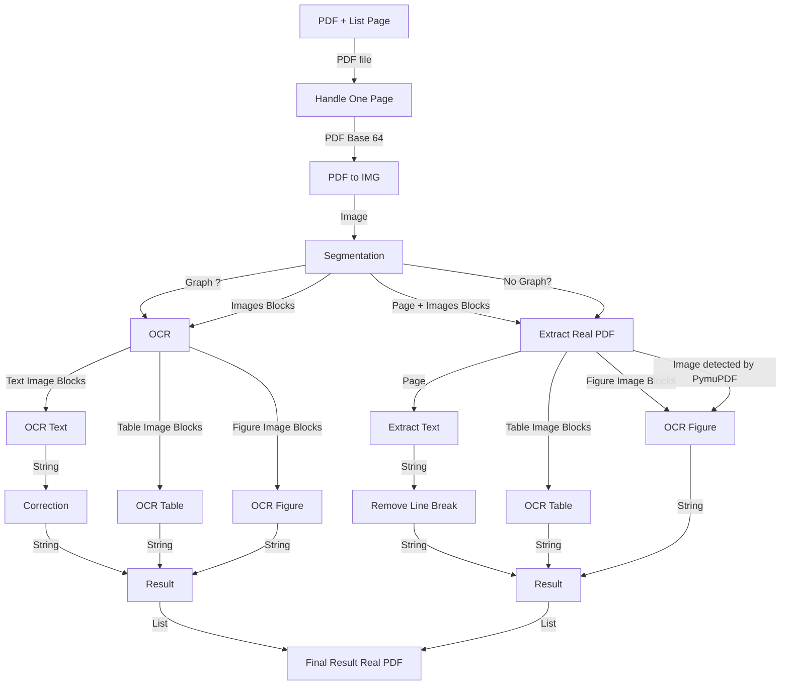
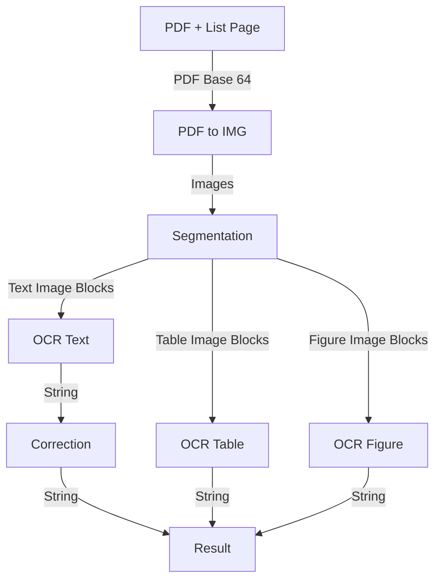
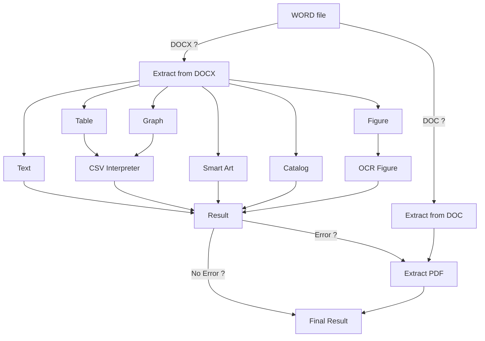
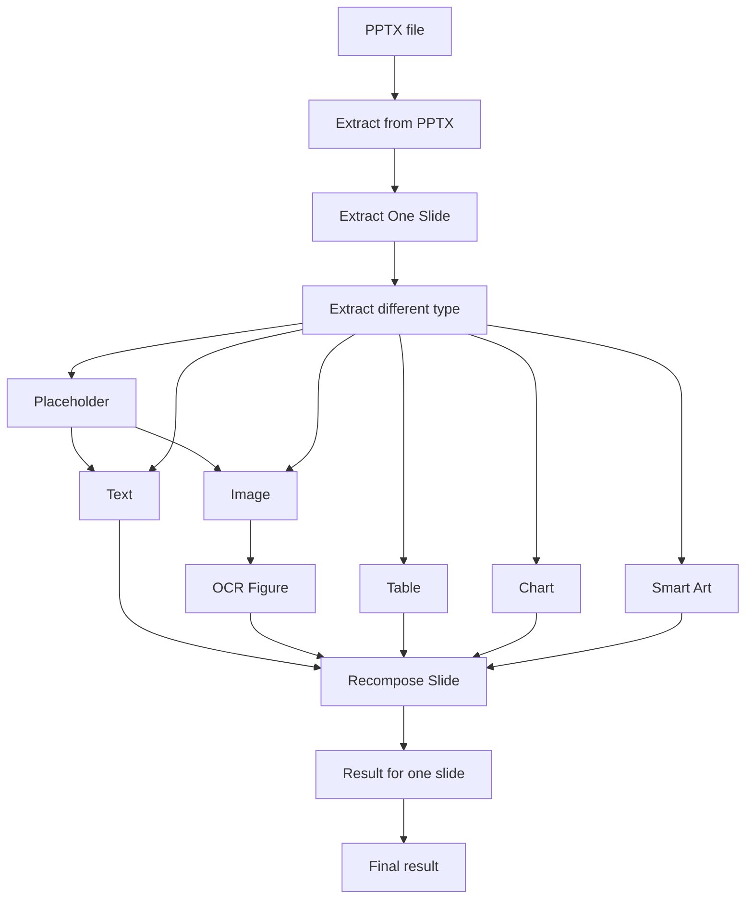
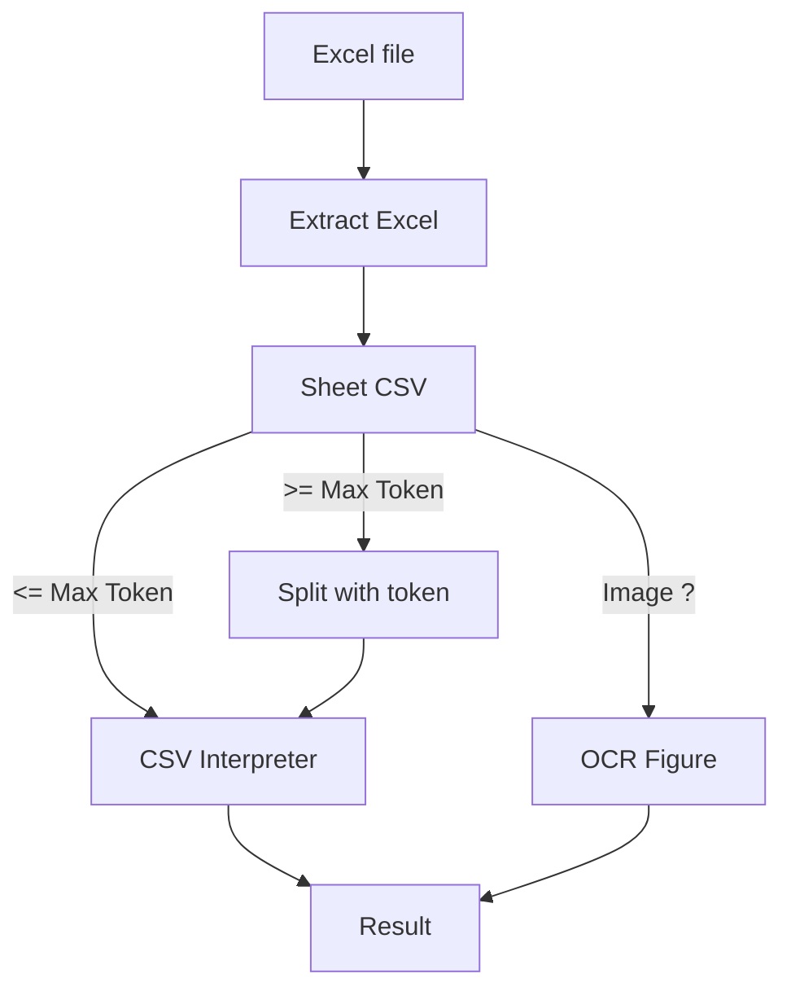

# Documentation_KAI

Extract PDF :






Extract real pdf : 



Extract Scan PDF:



Word:




PowerPoint:



Excel:




All : 

```mermaid
flowchart TD;
A[File] -- PDF --> B[Extract PDF];
B[PDF]-->Bpdf[Check Type];
Bpdf-- Scan PDF-->Cpdf[Extract Scan PDF];
Cpdf -->Ddpdf[pdfPDF to IMG];
Ddpdf--> Eepdf[Segmentation];
Eepdf-->Ffpdf[OCR Text];
Eepdf -->Ggpdf[OCR Table];
Eepdf -->Hhpdf[OCR Figure];
Ffpdf-->Iipdf[Correction];
Iipdf -->Jjpdf[Result];
Ggpdf -->Jjpdf;
Hhpdf -->Jjpdf;
Bpdf-- Real PDF -->Dpdf[Extract Real PDF];
Dpdf-->Kpdf[Handle One Page];
Kpdf -->Lpdf[PDF to IMG];
Lpdf -->Mpdf[Segmentation];
Mpdf--Graph -->Npdf[OCR];
Mpdf--No Graph-->Opdf[Extract Real PDF];
Npdf -->Ppdf[OCR Text];
Npdf -->Qpdf[OCR Table];
Npdf -->Rpdf[OCR Figure];
Ppdf -->Spdf[Correction];
Spdf -->Tpdf[Result];
Qpdf -->Tpdf;
Rpdf -->Tpdf;
Opdf -->Updf[Extract Text];
Opdf -->Vpdf[OCR Table];
Opdf -->Xpdf[OCR Figure];
Updf -->Wpdf[Remove Line Break];
Wpdf -->Ypdf[Result];
Vpdf -->Ypdf;
Xpdf -->Ypdf;
Tpdf -->Zpdf[Final Result Real PDF];
Ypdf -->Zpdf;
Jjpdf -->Fapdf[Assembler Block];
Zpdf -->Fapdf;
Fapdf -->Gapdf[Final Result];
A -- Excel --> Bex[Extract Excel];
Bex --> Cex[Sheet CSV];
Cex-- <= Max Token --> Dex[CSV Interpreter];
Dex-->Eex[Final Result];
Cex-- >= Max Token -->Fex[Split with token];
Fex-->Dex;
Cex-- Image ? --> Gex[OCR Figure];
Gex-->Eex;
A -- Word --> C[Extract Word];
C-- DOCX ? -->Bwo[ Extract from DOCX];
C-- DOC ? -->Cwo[Extract from DOC];
Bwo-->Dwo[Text];
Bwo-->Iwo[Table];
Bwo-->Gwo[Graph];
Bwo-->Ewo[Figure];
Bwo-->Hwo[Smart Art];
Bwo-->Fwo[Catalog];
Iwo-->Jwo[CSV Interpreter];
Ewo-->Kwo[OCR Figure];
Gwo-->Jwo;
Dwo-->Lwo[Result];
Jwo-->Lwo;
Hwo-->Lwo;
Fwo-->Lwo;
Kwo-->Lwo;
Lwo--No Error ? -->Nwo[Final Result];
Lwo--Error ? -->Mwo[Extract PDF];
Cwo-->Mwo;
Mwo-->Nwo;
A -- PowerPoint --> Bppt[Extract from PPTX];
Bppt-->Cppt[Extract One Slide];
Cppt-->Dppt[Extract different type];
Dppt-->Eppt[Placeholder];
Eppt-->Fppt;
Eppt-->Gppt;
Dppt-->Fppt[Text];
Dppt-->Gppt[Image];
Dppt-->Hppt[Table];
Dppt-->Ippt[Chart];
Dppt-->Jppt[Smart Art];
Gppt-->Kppt[OCR Figure];
Fppt-->Lppt[Recompose Slide];
Kppt-->Lppt;
Hppt-->Lppt;
Ippt-->Lppt;
Jppt-->Lppt;
Lppt-->Mppt[Result for one slide];
Mppt-->Nppt[Final result]


